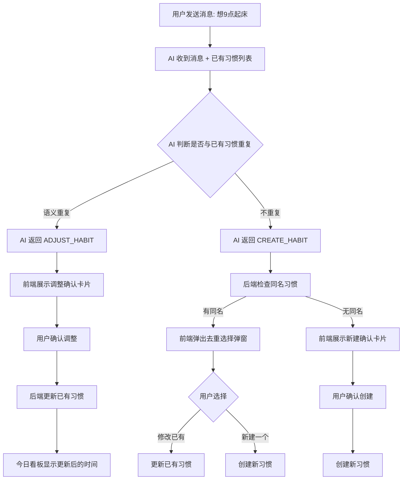
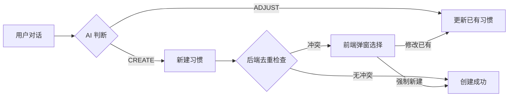

# PRD: 习惯去重与智能调整

> **文档版本**: 1.0
> **状态**: 草稿
> **作者**: 产品团队
> **创建日期**: 2026-05-25
> **最后更新**: 2026-05-25

<!-- TRACEABILITY-METADATA:BEGIN -->
```yaml
schema:
  name: testany-traceability
  version: "1.0.0"
  profile: prd-profile-v1
artifact:
  id: PRD-ULTRAFLOW-DEDUP-001
  type: PRD
  title: 习惯去重与智能调整
  status: draft
  owners: []
  created_at: 2026-05-25
  updated_at: 2026-05-25
  source_documents:
    - ultraflow-prd.md (v2.0 极律完整产品需求文档)
    - database-design.md (MongoDB 数据库设计文档)
entities:
  requirements:
    - REQ-DEDUP-001
    - REQ-DEDUP-002
    - REQ-DEDUP-003
    - REQ-DEDUP-004
    - REQ-DEDUP-005
    - REQ-DEDUP-006
    - REQ-DEDUP-007
    - REQ-DEDUP-008
    - REQ-DEDUP-009
    - REQ-DEDUP-010
  risks: []
  must_not_regress: []
  external_behaviors: []
  decisions: []
  flows: []
  test_cases: []
relations:
  - source: REQ-DEDUP-001
    target: PRD-ULTRAFLOW-001
    type: derived_from
    note: AI 对话习惯创建流程优化，源自 ultraflow-prd.md 7.2 节极律空间
waivers: []
```
<!-- TRACEABILITY-METADATA:END -->

---

## 1. 文档信息

### 1.1 基本信息

| 属性 | 值 |
|------|-----|
| PRD 编号 | PRD-ULTRAFLOW-DEDUP-001 |
| 所属产品 | 极律 UltraFlow |
| 优先级 | P0 |
| 预计版本 | v1.0 |
| PRD 基线版本 | v1.0 |
| 最后同步日期 | 2026-05-25 |

### 1.2 修订历史

| 版本 | 日期 | 变更内容 | 作者 |
|------|------|----------|------|
| 1.0 | 2026-05-25 | 初稿：习惯去重与智能调整功能 | 产品团队 |

### 1.3 术语表

| 术语 | 定义 |
|------|------|
| 语义去重 | 通过 AI 理解用户意图，判断新习惯是否与已有习惯重复 |
| 名称去重 | 通过习惯名称精确匹配，判断是否存在同名习惯 |
| ADJUST_HABIT | AI 返回的动作类型，表示调整已有习惯而非新建 |
| CREATE_HABIT | AI 返回的动作类型，表示创建新习惯 |

---

## 2. 背景与目标

### 2.1 业务背景

当前极律的 AI 对话创建习惯流程存在严重的重复创建问题：

**问题复现路径：**
1. 用户在极律空间说"我想每天早起" → AI 创建"早起"习惯（6:30）
2. 用户接着说"我想要9点起床" → AI 又创建了一个"早起"习惯（9:00）
3. 用户再说"我想12点起床" → AI 再创建一个"按时起床"习惯（12:00）
4. 今日看板出现 3 个起床类习惯，体验混乱

**根因分析：**

| 层级 | 问题 | 位置 |
|------|------|------|
| AI 上下文 | 只传了"活跃习惯数：3"，没传具体习惯列表 | `ai.py:265` build_user_context |
| AI Prompt | 没有指导 AI 在创建前检查是否与已有习惯重复 | BASE_SYSTEM_PROMPT |
| 后端逻辑 | confirm-habit 接口无条件 insert_one，不做去重 | `ai.py:93` confirm_habit |
| 前端交互 | 没有检测到重复时的用户选择机制 | — |

### 2.2 产品目标

- 消除重复习惯的创建，保证今日看板的习惯列表清晰无冗余
- AI 能感知用户已有习惯，在"调整"和"新建"之间做出正确判断
- 当检测到相似习惯时，给用户最终选择权，而非静默操作

### 2.3 成功指标

| 指标 | 目标值 | 数据来源 | 度量方式 |
|------|--------|----------|----------|
| 重复习惯创建率 | ≤ 5% | 后端日志 | 重复创建次数 / 总习惯创建次数 |
| AI 语义去重命中率 | ≥ 85% | 后端日志 | AI 正确返回 ADJUST_HABIT 的次数 / 实际应调整的次数 |
| 用户满意度 | 无投诉 | 用户反馈 | 上线后是否有关于重复习惯的反馈 |

### 2.4 业务现状

#### 当前流程

```
用户在极律空间说"想9点起床"
  → AI 收到消息 + 用户上下文（只有习惯数量）
  → AI 不知道已有"早起"习惯
  → AI 返回 CREATE_HABIT（新建）
  → 前端展示"确认开启"卡片
  → 用户点击确认
  → 后端 confirm-habit 无条件插入新记录
  → 今日看板出现两个"早起"习惯 ❌
```

#### 业务变更

| 变更项 | 变更前 | 变更后 |
|--------|--------|--------|
| AI 上下文 | 只传习惯数量 | 传完整习惯列表（名称、目标、频次、提醒时间） |
| AI Prompt | 无去重指导 | 增加"创建前检查已有习惯"的规则 |
| AI 返回 | CREATE_HABIT / ADJUST_HABIT | 不变，但 AI 能更准确地判断 |
| 后端创建 | 无条件插入 | 创建前检查同名习惯，存在则提示 |
| 前端交互 | 直接展示确认卡片 | 检测到相似习惯时弹出去重选择弹窗 |

#### 影响范围

| 影响对象 | 影响描述 |
|----------|----------|
| AI 对话模块 | 上下文增加习惯列表，Prompt 增加去重规则 |
| 习惯创建流程 | 增加去重检查和用户选择环节 |
| 后端接口 | confirm-habit 增加去重逻辑 |
| 今日看板 | 习惯列表更干净，不再出现重复项 |

### 2.5 相关能力识别

| 已有能力 | 能力范围 | 与本需求匹配度 | 能力差距 | 建议方向 | 来源 |
|----------|---------|--------------|---------|---------|------|
| build_user_context | 构建用户上下文传给 AI | 部分匹配 | 只传习惯数量，不传列表 | 需扩展 | `backend/app/services/ai.py:255` |
| assemble_prompt | 组装 AI 系统提示词 | 部分匹配 | 无去重相关规则 | 需扩展 | `backend/app/services/ai.py:247` |
| ADJUST_HABIT 动作 | AI 返回调整习惯的结构化数据 | 完全匹配 | 无 | 建议复用 | `backend/app/services/ai.py:56` |
| confirm-habit 接口 | 确认创建习惯 | 部分匹配 | 无去重检查 | 需扩展 | `backend/app/api/ai.py:77` |
| habits_collection 查询 | 查询用户活跃习惯 | 完全匹配 | 无 | 建议复用 | `backend/app/core/database.py` |

---

## 3. 范围

### 3.1 范围内

- AI 上下文增加用户已有习惯列表
- AI Prompt 增加去重判断规则和示例
- 后端 confirm-habit 增加同名习惯检测
- 前端增加"检测到相似习惯"的去重选择弹窗
- 前端展示"调整成功"而非"已开启"的反馈

### 3.2 范围外

- 习惯合并（将两个已存在的重复习惯合并为一个）
- 历史重复习惯的批量清理工具
- 跨用户的习惯去重
- 习惯名称同义词库维护

### 3.3 待确认事项

- [ ] 去重弹窗中"新建一个"选项是否保留（允许用户明确创建两个同类型习惯）
- [ ] ADJUST_HABIT 时是否允许修改习惯名称（如"早起"改为"按时起床"）

---

## 4. 用户旅程

### 4.1 目标用户

在极律空间通过自然语言对话创建和调整习惯的所有用户。

### 4.2 前置条件

| 条件 | 说明 |
|------|------|
| 用户已登录 | 有有效的 JWT token |
| 用户已有至少一个活跃习惯 | 去重逻辑的前提 |
| AI 对话正常可用 | MiMo API 可访问 |

### 4.3 主流程



### 4.4 异常流程

| 异常场景 | 处理方式 |
|----------|----------|
| AI 误判（应该调整但返回了新建） | 后端同名检查兜底，弹出去重弹窗 |
| AI 误判（应该新建但返回了调整） | 前端展示调整卡片，用户可取消后重新描述 |
| 用户拒绝调整和新建 | 关闭卡片，无操作 |
| 后端更新失败 | Toast 提示"操作失败"，不阻断对话 |

---

## 5. 功能需求

### 5.1 AI 上下文增强

#### 5.1.1 功能描述

在 `build_user_context` 中，将用户的活跃习惯列表（名称、目标、频次、提醒时间）作为上下文传给 AI，使 AI 能感知用户已有习惯。

#### 5.1.2 上下文格式

当前上下文：
```
- 昵称：用户abc123
- 当前人设：rational_mentor
- 活跃习惯数：2
- 当前日期：2026-05-25
```

增强后上下文：
```
- 昵称：用户abc123
- 当前人设：rational_mentor
- 当前日期：2026-05-25
- 已有活跃习惯：
  - 早起（目标：6:30起床，每天，提醒 06:30）
  - 阅读（目标：半小时，每天，提醒 21:00）
```

### 5.2 AI Prompt 去重规则

#### 5.2.1 功能描述

在 BASE_SYSTEM_PROMPT 中增加去重判断规则，指导 AI 在创建习惯前先检查是否与已有习惯语义重复。

#### 5.2.2 去重规则

| 规则 | 说明 |
|------|------|
| 语义匹配 | 当用户表达的意图与已有习惯属于同一类行为时，视为重复 |
| 调整优先 | 检测到重复时，优先返回 ADJUST_HABIT 而非 CREATE_HABIT |
| 差异化新建 | 只有当习惯目标有本质区别时才新建（如"跑步"和"阅读"是不同习惯） |
| 时间变更视为调整 | "我想9点起床" + 已有"早起 6:30" → 调整，不是新建 |

#### 5.2.3 Prompt 新增内容

在 `extractedHabit 判定规则` 中增加：

```
### 去重规则（CRITICAL）

创建习惯前，必须检查用户上下文中的「已有活跃习惯」列表：

1. 如果用户表达的意图与某个已有习惯属于同一类行为（语义匹配）：
   - 返回 ADJUST_HABIT，而不是 CREATE_HABIT
   - 用新信息更新该习惯的对应字段（如时间、目标）
   - 在 reply 中明确告知用户"已为你调整了 XX 习惯"

2. 语义匹配的判断标准（满足任一即为重复）：
   - 核心行为相同：如"早起"和"9点起床"都是关于起床时间
   - 名称高度相似：如"跑步"和"晨跑"、"阅读"和"看书"
   - 用户明确提到已有习惯的名称：如"把早起改到9点"

3. 以下情况视为不同习惯，应 CREATE_HABIT：
   - 核心行为不同：如"跑步"和"阅读"
   - 同一行为但目标维度不同：如"早上跑步"和"晚上散步"（时间段+强度不同）

4. 示例：
   - 已有习惯："早起 6:30"，用户说"想9点起床" → ADJUST_HABIT（调整时间）
   - 已有习惯："阅读"，用户说"想看半小时书" → ADJUST_HABIT（同一习惯）
   - 已有习惯："跑步"，用户说"想学英语" → CREATE_HABIT（不同习惯）
```

#### 5.2.4 新增 Few-shot 示例

```
### 示例 6：调整已有习惯（用户提到新时间）

用户：我想9点起床

回复：
{
  "reply": "好的，已帮你把起床时间调整到 9:00，记得配合固定的就寝时间保证充足睡眠。",
  "extractedHabit": {
    "action": "ADJUST_HABIT",
    "habitName": "早起",
    "target": "9:00起床",
    "frequency": "daily",
    "reminderTime": "09:00"
  }
}

### 示例 7：语义重复（用户换了说法）

用户：我想每天看书半小时

（假设已有习惯：阅读，21:00，每天）

回复：
{
  "reply": "你已经有一个「阅读」习惯了，我帮你把目标调整为半小时看看？",
  "extractedHabit": {
    "action": "ADJUST_HABIT",
    "habitName": "阅读",
    "target": "半小时",
    "frequency": "daily",
    "reminderTime": "21:00"
  }
}
```

### 5.3 后端去重检查

#### 5.3.1 功能描述

在 `confirm-habit` 接口中，当 AI 返回 `CREATE_HABIT` 时，后端检查是否已有同名活跃习惯。

#### 5.3.2 检查逻辑

```
收到 confirm-habit 请求
  → 查询该用户是否有同名活跃习惯
  → 有 → 返回 409 + 已有习惯信息（前端弹窗让用户选择）
  → 没有 → 正常创建
```

#### 5.3.3 接口行为

| 场景 | 行为 | 返回 |
|------|------|------|
| CREATE_HABIT + 无同名 | 正常创建 | 201 + 新习惯 |
| CREATE_HABIT + 有同名 | 返回冲突 | 409 + 已有习惯信息 |
| ADJUST_HABIT | 更新已有习惯 | 200 + 更新后习惯 |

### 5.4 前端去重选择弹窗

#### 5.4.1 功能描述

当后端返回 409（同名习惯冲突）时，前端弹出选择弹窗，让用户决定是修改已有习惯还是新建一个。

#### 5.4.2 UI 布局

```
┌──────────────────────────────────────────────┐
│                                              │
│              （背景变暗）                      │
│                                              │
│  ┌────────────────────────────────────────┐  │
│  │                                        │  │
│  │      ⚠️ 检测到相似习惯                  │  │
│  │                                        │  │
│  │   你已经有一个「早起」习惯               │  │
│  │   当前目标：6:30 起床                    │  │
│  │                                        │  │
│  │   你想怎么处理？                        │  │
│  │                                        │  │
│  │   ┌────────────────────────────────┐   │  │
│  │   │   修改为 9:00 起床              │   │  │
│  │   └────────────────────────────────┘   │  │
│  │                                        │  │
│  │   ┌────────────────────────────────┐   │  │
│  │   │   新建一个独立习惯              │   │  │
│  │   └────────────────────────────────┘   │  │
│  │                                        │  │
│  │          取消，不做任何操作              │  │
│  │                                        │  │
│  └────────────────────────────────────────┘  │
│                                              │
└──────────────────────────────────────────────┘
```

#### 5.4.3 交互规格

| 元素 | 交互 | 结果 |
|------|------|------|
| "修改为 X"按钮 | 点击 | 调用更新接口，修改已有习惯的对应字段，Toast 提示"已调整" |
| "新建一个独立习惯"按钮 | 点击 | 调用创建接口（强制创建，跳过去重检查），创建新习惯 |
| "取消"链接 | 点击 | 关闭弹窗，不做任何操作 |
| 弹窗外区域 | 点击 | 不关闭弹窗（强制用户做出选择） |

#### 5.4.4 弹窗数据来源

弹窗内容由以下数据拼接：

| 字段 | 来源 | 说明 |
|------|------|------|
| 已有习惯名称 | 409 响应中的 existing.name | 如"早起" |
| 已有习惯目标 | 409 响应中的 existing.target | 如"6:30起床" |
| 新目标描述 | 用户发送的消息或 AI 提取的 target | 如"9:00起床" |

### 5.5 AI 调整确认卡片

#### 5.5.1 功能描述

当 AI 返回 `ADJUST_HABIT` 时，前端展示调整确认卡片（区别于新建确认卡片），让用户确认是否调整已有习惯。

#### 5.5.2 UI 布局

```
┌────────────────────────────────────────┐
│ 📋 调整习惯确认                         │
│                                        │
│ 习惯：早起                              │
│ ──────────────────────────────────────  │
│ 时间：6:30  →  9:00    ← 变化高亮       │
│ 目标：每天早起                          │
│ 频次：每天                              │
│                                        │
│ [ 确认调整 ]  [ 取消 ]                  │
└────────────────────────────────────────┘
```

#### 5.5.3 与新建卡片的区别

| 元素 | 新建确认卡片 | 调整确认卡片 |
|------|------------|------------|
| 标题 | 新习惯确认 | 调整习惯确认 |
| 按钮文案 | 确认开启 | 确认调整 |
| 变化提示 | 无 | 高亮显示变化的字段（如时间 6:30 → 9:00） |
| 操作 | 创建新记录 | 更新已有记录 |

---

## 6. 数据概念

### 6.1 业务实体

| 实体 | 说明 | 关键属性 |
|------|------|----------|
| 习惯 | 用户创建的日常习惯 | 名称、目标、频次、提醒时间、状态 |
| 对话消息 | 用户与 AI 的对话记录 | 角色、内容、提取的习惯数据 |

### 6.2 实体关系

本功能不引入新的实体关系，核心变化是**习惯的创建和调整流程**。



---

## 7. 非功能需求

### 7.1 性能要求

| 场景 | 要求 |
|------|------|
| AI 响应时间 | 不因增加上下文而明显变慢（习惯列表限制 50 条以内） |
| 去重弹窗弹出 | ≤ 300ms |
| 习惯更新/创建 | ≤ 500ms |

### 7.2 兼容性要求

| 要求 | 说明 |
|------|------|
| 无活跃习惯时 | 正常创建，不触发去重逻辑 |
| AI 返回格式异常 | 后端兜底，不阻断用户操作 |

---

## 8. 依赖与约束

### 8.1 已知约束

- AI 语义去重依赖大模型的理解能力，无法 100% 准确
- 习惯列表过长时（>50 条），上下文可能超出 token 限制，需截断
- 仅对"活跃"状态的习惯去重，已暂停/归档的习惯不影响

### 8.2 外部依赖

- MiMo AI API（语义理解能力）

---

## 9. 验收标准

### AC-001: AI 上下文包含习惯列表
- [ ] AI 对话时，系统 Prompt 中包含用户的活跃习惯列表
- [ ] 习惯列表包含名称、目标、频次、提醒时间

### AC-002: AI 语义去重
- [ ] 用户说"想9点起床"，已有"早起 6:30"习惯，AI 返回 ADJUST_HABIT
- [ ] 用户说"想看书半小时"，已有"阅读"习惯，AI 返回 ADJUST_HABIT
- [ ] 用户说"想学英语"，已有"早起"习惯，AI 返回 CREATE_HABIT

### AC-003: 后端同名检查
- [ ] confirm-habit 收到 CREATE_HABIT 且有同名习惯时，返回 409
- [ ] confirm-habit 收到 ADJUST_HABIT 时，更新已有习惯

### AC-004: 前端去重弹窗
- [ ] 收到 409 响应时，弹出去重选择弹窗
- [ ] 弹窗显示已有习惯名称和目标
- [ ] 点击"修改为 X"后，更新已有习惯
- [ ] 点击"新建一个"后，强制创建新习惯
- [ ] 点击"取消"后，关闭弹窗

### AC-005: 调整确认卡片
- [ ] AI 返回 ADJUST_HABIT 时，展示调整确认卡片（区别于新建卡片）
- [ ] 卡片标题为"调整习惯确认"，按钮为"确认调整"
- [ ] 变化的字段有高亮提示（如时间 6:30 → 9:00）

### AC-006: 今日看板无重复
- [ ] 经过去重流程后，今日看板不会出现同名或同类的重复习惯
- [ ] 用户创建 3 个不同时间的"早起"，最终只有 1 个（被调整而非重复创建）

### UX-001: 交互体验
- [ ] 去重弹窗动画流畅（≤ 300ms）
- [ ] 调整成功后 Toast 提示"已调整：早起 9:00"
- [ ] 操作失败时有明确错误提示

---

## 10. 风险与缓解

| 风险 | 影响 | 概率 | 缓解措施 |
|------|------|------|----------|
| AI 语义判断不准确 | 可能误判为新建或调整 | 中 | 后端同名检查兜底 + 前端弹窗给用户选择权 |
| 习惯列表过长导致 token 超限 | AI 响应变慢或失败 | 低 | 限制最多传 50 条活跃习惯 |
| 用户确实想创建两个同类习惯 | 去重过于激进 | 低 | 弹窗提供"新建一个"选项 |

---

## 11. 待澄清问题

| 编号 | 问题 | 状态 | 结论 |
|------|------|------|------|
| Q1 | ADJUST_HABIT 时是否允许修改习惯名称？ | 待讨论 | — |
| Q2 | 去重弹窗中"新建一个"选项是否保留？ | 待讨论 | — |
| Q3 | 已暂停/归档的习惯是否参与去重？ | 待讨论 | — |

---

## 附录 A：技术实现参考

> 以下代码仅供参考，帮助开发者理解技术方案，不属于 PRD 需求定义。

### A.1 build_user_context 增强

```python
async def build_user_context(user_doc: dict | None) -> str:
    if not user_doc:
        return ""

    nickname = user_doc.get("nickname", "用户")
    persona = user_doc.get("coachPersona", "rational_mentor")
    user_id = user_doc.get("userId") or user_doc.get("_id")

    context = (
        f"- 昵称：{nickname}\n"
        f"- 当前人设：{persona}\n"
        f"- 当前日期：{datetime.now().strftime('%Y-%m-%d')}\n"
    )

    if user_id:
        habits = await habits_collection.find(
            {"userId": user_id, "status": "active"}
        ).to_list(50)

        if habits:
            habit_lines = []
            for h in habits:
                habit_lines.append(
                    f"  - {h['name']}（目标：{h['target']}，"
                    f"{h['frequency']}，提醒 {h['reminderTime']}）"
                )
            context += f"- 已有活跃习惯：\n" + "\n".join(habit_lines) + "\n"
        else:
            context += "- 已有活跃习惯：无\n"

    return context
```

### A.2 后端 confirm-habit 去重

```python
@router.post("/confirm-habit")
async def confirm_habit(request: ConfirmHabitRequest, current_user: dict = Depends(get_current_user)):
    user_id = current_user["_id"]

    # 去重检查：是否有同名活跃习惯
    existing = await habits_collection.find_one({
        "userId": user_id,
        "name": request.habitName,
        "status": "active"
    })

    if existing:
        # 返回 409 冲突，附带已有习惯信息
        raise HTTPException(status_code=409, detail={
            "message": "已存在同名习惯",
            "existing": {
                "_id": str(existing["_id"]),
                "name": existing["name"],
                "target": existing["target"],
                "frequency": existing["frequency"],
                "reminderTime": existing["reminderTime"],
            }
        })

    # 无冲突，正常创建
    now = datetime.utcnow()
    habit_doc = { ... }
    result = await habits_collection.insert_one(habit_doc)
    return { ... }
```

### A.3 前端去重弹窗逻辑

```typescript
async function onConfirmHabit(habit: HabitCardData) {
  try {
    await AIStore.confirmHabit(habit);
    uni.showToast({ title: '已开启', icon: 'success' });
  } catch (err: any) {
    if (err?.status === 409) {
      // 同名冲突，弹出去重弹窗
      conflictHabit.value = err.data.existing;
      newHabit.value = habit;
      showConflictModal.value = true;
    } else {
      uni.showToast({ title: '操作失败', icon: 'none' });
    }
  }
}

// 用户选择"修改已有"
async function onModifyExisting() {
  await HabitApi.update(conflictHabit.value._id, {
    target: newHabit.value.target,
    reminderTime: newHabit.value.reminderTime,
  });
  showConflictModal.value = false;
  uni.showToast({ title: '已调整', icon: 'success' });
}

// 用户选择"新建一个"
async function onCreateNew() {
  await AIStore.confirmHabit(newHabit.value, { force: true });
  showConflictModal.value = false;
  uni.showToast({ title: '已开启', icon: 'success' });
}
```
